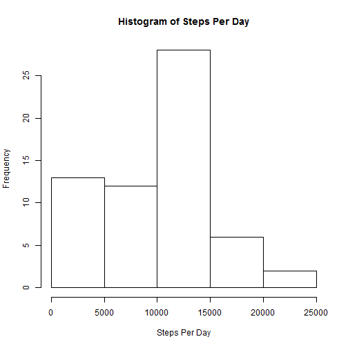
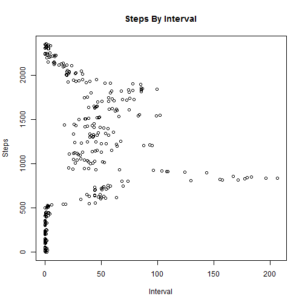
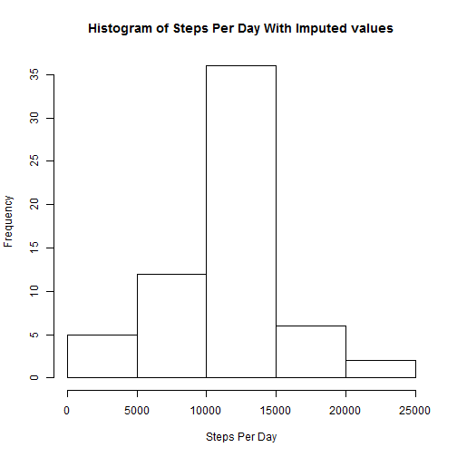

---
title: "Reproducible Research: Peer Assessment 1"
output: 
  html_document:
      keep_md: true
--
## Loading and preprocessing the data 


```r
data <- read.csv ("activity.csv") 
data$date = as.Date(data$date)
StepsByDate <- aggregate(data$steps, list(date=data$date),sum, na.rm=TRUE)
hist(StepsByDate$x, xlab="Steps Per Day", main="Histogram of Steps Per Day")
```

 

## What is mean total number of steps taken per day

* The mean steps for day is 9354.2295082
* The median steps for day is 10395

## What is the average daily activity pattern?


```r
StepsByInterval <- aggregate (data$steps, list(interval=data$interval), mean, na.rm=TRUE)
plot.ts(StepsByInterval$x, StepsByInterval$interval, xlab="Interval",ylab="Steps", main="Steps By Interval")
```

 

## Imputing missing values

* Total rows with missing data is 17568


```r
data1 <- data
for (i in 1:nrow(data1)) {data1[i,1] = ifelse (is.na(data1[i,1]),StepsByInterval[StepsByInterval$interval==data1[i,3],2],data1[i,1])}
StepsByDate1 <- aggregate(data1$steps, list(date=data1$date),sum, na.rm=TRUE)
hist(StepsByDate1$x, xlab="Steps Per Day", main="Histogram of Steps Per Day With Imputed values")
```

 


* The mean steps for day with imputed values is 10766
* The median steps for day with imputed values is 10766

## Are there differences in activity patterns between weekdays and weekends?


```r
library(dplyr)
library(lattice)

data1$day <- ifelse (weekdays(data1$date) == 'Saturday' | weekdays(data1$date) == 'Sunday','Weekend','Weekday')
data1$day <- factor (data1$day)

plotdf <- data1 %>%
  group_by(day, interval) %>%
    summarize (averageSteps = mean(steps))
xyplot(plotdf$averageSteps ~ plotdf$interval | plotdf$day, 
       layout = c(1,2), type="l", 
       ylab="Number of steps", xlab = "Interval" ) 
```

 
